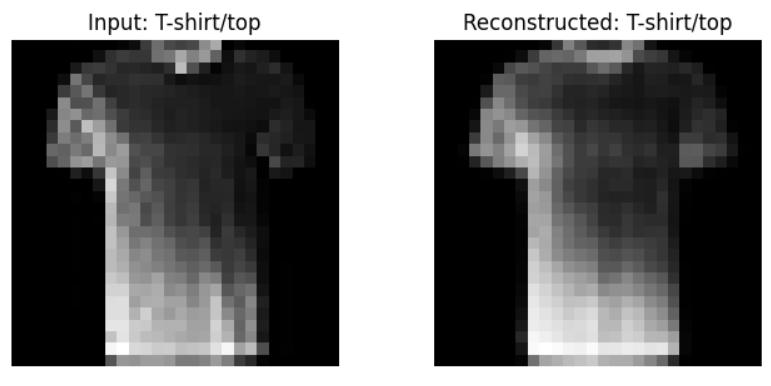
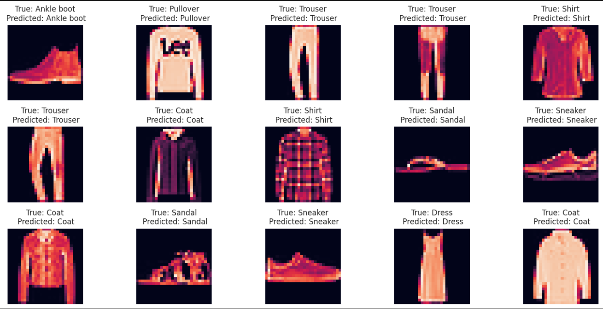
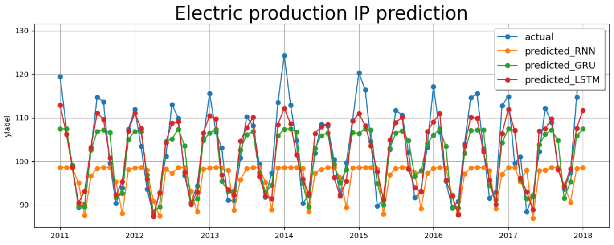
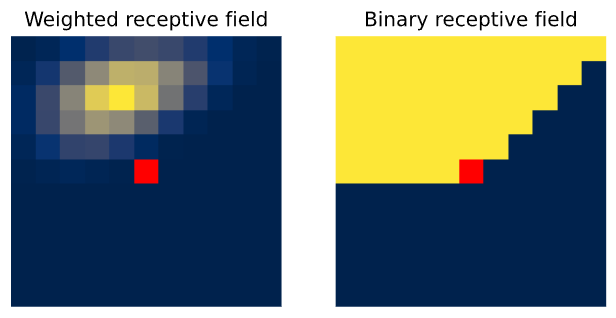
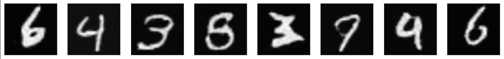
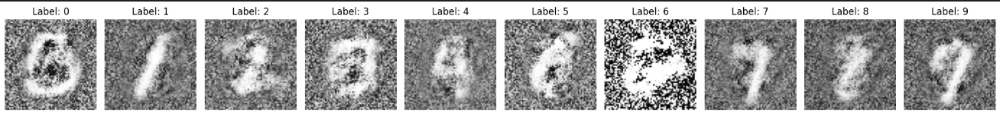
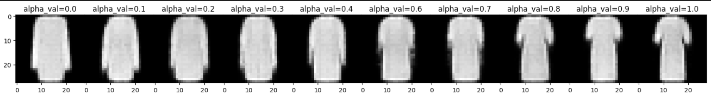

# Deep Learning Homework Solutions

## Table of Contents

1. [Homework 1: Dimensionality Reduction and Autoencoder on Fashion-MNIST](#homework-1-dimensionality-reduction-and-autoencoder-on-fashion-mnist)
  
2. [Homework 2: CNNs and Transfer Learning](#homework-2-cnns-and-transfer-learning)
    - [Part 1: ResNet on CIFAR-10](#part-1-resnet-on-cifar-10)
    - [Part 2: CNN on Fashion-MNIST](#part-2-cnn-on-fashion-mnist)

3. [Homework 3: Time Series and Text Generation](#homework-3-time-series-and-text-generation)
    - [Part 1: Time Series Prediction](#time-series-prediction)
    - [Part 2: Character-level Text Generation](#character-level-text-generation)

4. [Homework 4: Masked Language Modeling and Graph Embedding](#homework-4-masked-language-modeling-and-graph-embedding)
    - [Part 1: Masked Language Model](#part-1-masked-language-model)
    - [Part 2: POS Tagging with Fine-tuned RoBERTa](#part-2-pos-tagging-with-fine-tuned-roberta)
    - [Part 3: Graph Embedding using DeepWalk](#part-3-graph-embedding-using-deepwalk)

5. [Homework 5: Generative Models and Variational Autoencoder](#homework-5-generative-models-and-variational-autoencoder)
    - [Part 1: Autoregressive Image Modeling](#part-1-autoregressive-image-modeling)
    - [Part 2: GAN and CGAN on MNIST](#part-2-gan-and-cgan-on-mnist)
    - [Part 3: Variational Autoencoder on Fashion-MNIST](#part-3-variational-autoencoder-on-fashion-mnist)

6. [Homework 6: Deep Q-Learning for Lunar Lander](#homework-6-deep-q-learning-for-lunar-lander)

---

## Homework 1: Dimensionality Reduction and Autoencoder on Fashion-MNIST

### Tasks Overview

In this practical assignment, I have worked with the Fashion-MNIST dataset to implement several neural network-based models. The tasks involve reducing data dimensionality, training an autoencoder, and visualizing latent representations using PCA and t-SNE.

- I implemented the PCA algorithm and applied it to the test set.
- I applied PCA and t-SNE to visualize the data in 2D.
- I trained a stacked autoencoder and used its encoder for classification.
- I used PCA and t-SNE to visualize encoded test set data.
- I added a classification layer on top of the encoder to predict image labels.

  

  <em>Comparison of input image and reconstructed image</em>

---

## Homework 2: CNNs and Transfer Learning

### Part 1: ResNet on CIFAR-10

I have fine-tuned a pre-trained ResNet50 model for the CIFAR-10 image classification task. This involved loading the dataset, configuring the model for transfer learning, and evaluating its performance.

  

  <em>Evaluate fine-tuned Resnet over some samples of Validation Set</em>

### Part 2: CNN on Fashion-MNIST

In this part, I implemented a convolutional neural network (CNN) from scratch to classify images from the Fashion-MNIST dataset. The process included:

- Loading and splitting the dataset.
- Implementing the CNN model using PyTorch.
- Training, validating, and testing the model, with metrics tracking.

---

## Homework 3: Time Series and Text Generation

### Time Series Prediction

I have built and trained models for time series prediction, exploring and comparing three architectures: Simple RNN, GRU, and LSTM. I evaluated their performance and analyzed which model performed best and why.

  

  <em>Performance comparison of vanilla RNN, LSTM and GRU on Electric Production dataset</em>

### Character-level Text Generation

I implemented text generation at the character level using recurrent neural networks (RNNs). This involved training RNNs and LSTMs, fine-tuning the models, and generating coherent text sequences from the learned models.

---

## Homework 4: Masked Language Modeling and Graph Embedding

### Part 1: Masked Language Model

I have implemented a Masked Language Model (MLM) in PyTorch from scratch and compared it with a pre-trained RoBERTa model using HuggingFace's Trainer API.

### Part 2: POS Tagging with Fine-tuned RoBERTa

I fine-tuned the RoBERTa model for a part-of-speech tagging task on the Parsig dataset. I leveraged RoBERTa's attention mechanisms to accurately predict and label the grammatical roles of words in a sentence.

### Part 3: Graph Embedding using DeepWalk

In this task, I employed the DeepWalk technique to perform graph embedding on the small version of the Movielens dataset, transforming the movie data into vector space for downstream tasks.

---

## Homework 5: Generative Models and Variational Autoencoder

### Part 1: Autoregressive Image Modeling

I have implemented an autoregressive likelihood model for image generation. The model learned the conditional probability distribution of each pixel given its preceding ones. I also explored the benefits and limitations of such models.

  

  <em>Comparison of weighted receptive field and binary receptive field in PixelCNN</em>

### Part 2: GAN and CGAN on MNIST

I built and trained a basic Generative Adversarial Network (GAN) to generate handwritten digits from the MNIST dataset. Additionally, I implemented a Conditional GAN (CGAN) where image generation is conditioned on the digit labels.

  

  <em>Visualization of basic Generative Adversarial Network (GAN) results</em>

  

  <em>Visualization of conditional Generative Adversarial Network (GAN) results</em>

### Part 3: Variational Autoencoder on Fashion-MNIST

I implemented and trained a Variational Autoencoder (VAE) on the Fashion-MNIST dataset. This task involved exploring how the VAE's latent space captures data variance, allowing for both reconstruction and sampling of new fashion items.

  

  <em>Interpolation of two images in the embedding space of a Variational Autoencoder (VAE)</em>

---

## Homework 6: Deep Q-Learning for Lunar Lander

I implemented the Deep Q-Learning (DQN) algorithm to control a lunar lander in OpenAI's Gym environment. The key aspects of this project included:

- Training an agent to safely land the lunar module.
- Using experience replay and target networks for stable training.
- Tuning hyperparameters and evaluating the model's performance.
